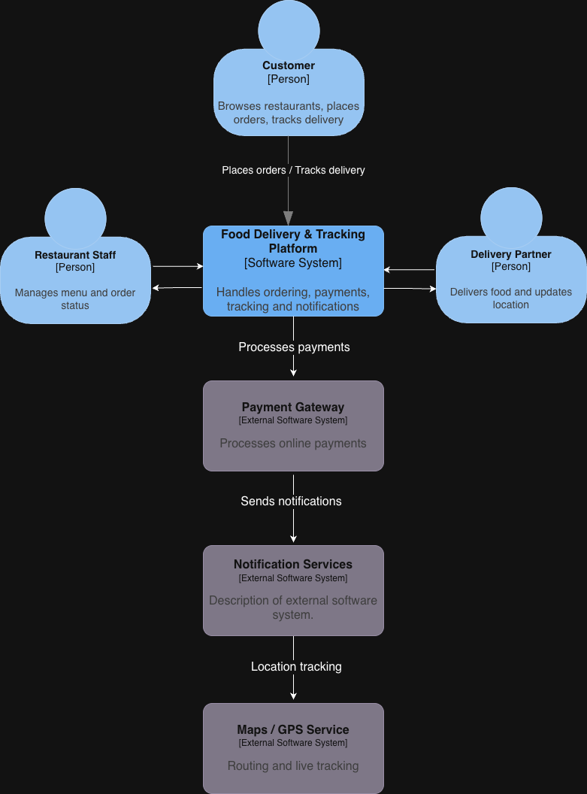

# ARC42 Documentation: Sections 1–3

**Project Name:** PRJ07: Food Delivery and Tracking Platform
**Team Members:**

- Ishimwe Pacis Hanyurwimfura
- Aditya Bhosale
- Alfarizy Alfarizy

  **Date:** 27th January 2026
  **Version:** 1.0 (Lab 2 Draft)

---

## Section 1: Introduction and Goals

### 1.1 Requirements Overview

**What is the system?**

The system is a food delivery and tracking platform that connects customers, restaurants, drivers, and payments in one workflow.
Customers can browse menus, place orders, pay, and then follow their delivery progress via live (simulated in this case) status updates and driver location tracking.

**Core Features:**

1. Restaurant and menu browsing (availability, items, pricing)
2. Order placement and processing (create order, confirm, pay, update status)
3. Delivery assignment, tracking, and customer notifications (driver assignment, simulated GPS, order progress updates)

### 1.2 Quality Goals

| Priority | Quality Attribute    | Motivation         |
| -------- | -------------------- | ------------------ |
| 1        | Reliability/Availability | As the customers, they would expect ordering and tracking to work consistently. Missed on updates or downtime will break the trust and cause support problems. |
| 2        | Performance/Responsiveness  | Browsing menus and seeing status updates should feel fast and seamless. Slow APIs will make the app feel "broken" even if it is technically working. |
| 3        | Maintainability + Reusability    | Services should be self-contained and high-level (like Order, Payment, and Delivery). This will make them easy to reuse later for things like catering or meal-prep, and it will allow teams to improve or change one service without touching the rest of the system. |

### 1.3 Stakeholders

| Role                                  | Description    | Expectations         |
|---------------------------------------| -------------- | -------------------- |
| End User (customer)                   | Person who orders food and trakcs delivery | Easy restaurant/menu browsing, simple checkout, clear order status updates, and accurate delivery tracking |
| Administrator(restaurant staff/admin) | Managing restaurant availability and menu, receiving and fulfilling orders | See incoming orders, update order preparation status, manage menu items/availability, and minimal confusion/duplicate orders|
| Developer (project team)              | Building and evolving the system| Clear service boundaries and contracts, good testability, stable APIs, and a design that matches SOA (coarse-grained, reusable services)|
|System administrator|aintain platform configuration and monitor health|Basic monitoring/logs, ability to manage restaurant/driver accounts in the system, and visibility into failures (payment mock failures, delivery issues)|

---

# Section 2: Constraints

### 2.1 Technical Constraints

#### Constraints 1: Use service oriented architecture(SOA)
- To have re-usable services across applications  
- To have services that represents business capabilities not granular functions
- Scalable services
- Example of such services representing Business capabilities (Client management, order management ,Payment & Billing, Notification |

#### Constraints 2: Communication through standardized contracts
- A standarzized communination Protocol between the services (Rest or SOA)
- Ensure security of the data from service A to B

#### Constraints 3: Simulated Restaurant Data
- Allow the system to be developed and tested without the need of real restaurant data
- Make the development process faster

#### Constraints 4: Simulated GPS Tracking
- To enable demonstration of delivery without the need of physical delivery device

#### Constraints 5: Simulated GPS Tracking
- To enable demonstration of delivery without the need of physical delivery device

### 2.2 Organizational Constraints

#### Constraints 1: Limited Development Team
- The Project shall be built by a team of 3-4 students which limits the complexity of the system.

#### Constraints 2: Project Timeline
- The Project shall be built be developed in a duration of 13 weeks this limits the core functionalities to be
  developed to ordering, payment & delivery simulation.

#### Constraints 3: Academic Level
- The system design shall align with students skill set and avoid complex technologies that might hinder the project timeline

### 2.3 Conventions
#### Constraints 1: Use of standardized contracts
- The system should use standardized communication between service being SOA or Rest.

#### Constraints 2: Comply with Academic requirements
- Comply with academic requirements and good practices like documentation, arichitecture justifiction.
---

## Section 3: Context and Scope

### 3.1 Business Context

**System Context Diagram:**

**External Interfaces:**

| Interface                       | Description                                                                                            | Technology                          |
|---------------------------------|--------------------------------------------------------------------------------------------------------|-------------------------------------|
| Customer Mobile/Web App         | Allows customers to browse restaurants, place orders, make payments, and track deliveries in real time | Web Dashboard (React), REST APIs    |
| Restaurant Management Interface | Enables restaurant staff to manage menus, accept/rejects orders, and update preparation status         | Web Dashboard (React), REST APIs    |
| Delivery Partner App            | Allows delivery partners to accept delivery requests, update order status, and share live location     | Mobile App, REST APIs, GPS          |
| Payment Gateway Interface       | Processes online payments and returns payment status                                                   | REST APIs, Cards/Wallets            |
| Notification Service Interface  | Sends order confirmations, status updates, and delivery alerts                                         | REST APIs, Webhooks, SMS/Email/Push |
| Maps / GPS Interface            | Provides routing, distance calculation, and live location tracking.                                    | GPS, API                            |

### 3.2 Technical Context

| Component                    | Technology                   | Purpose                                                                         |
|------------------------------|------------------------------|---------------------------------------------------------------------------------|
| Customer Application         | React (Web),Flutter (Mobile) | User-facing interface for browsing, ordering, payment, and tracking             |
| Restaurant Dashboard         | React                        | Interface for restaurant staff to manage orders and menus                       |
| Delivery Partner Application | Flutter                      | Interface for delivery agents to manage deliveries and share location           |
| Food Delivery Backend System | Spring Boot (Microservices)  | Core business logic for order processing, tracking, payments, and notifications |
| Payment Gateway              | Paypal                       | Secure payment processing                                                       |
| Notification Service         | Firebase Cloud Messaging     | Sends real-time alerts and updates                                              |
| Maps / GPS Service           | Google Maps API              | Provides routing and real-time delivery tracking                                |
| Database                     | PostgreSQL                   | Stores orders, users, restaurants, and delivery data                            |
---

_This document will be expanded in M2 to include Sections 4–5._
